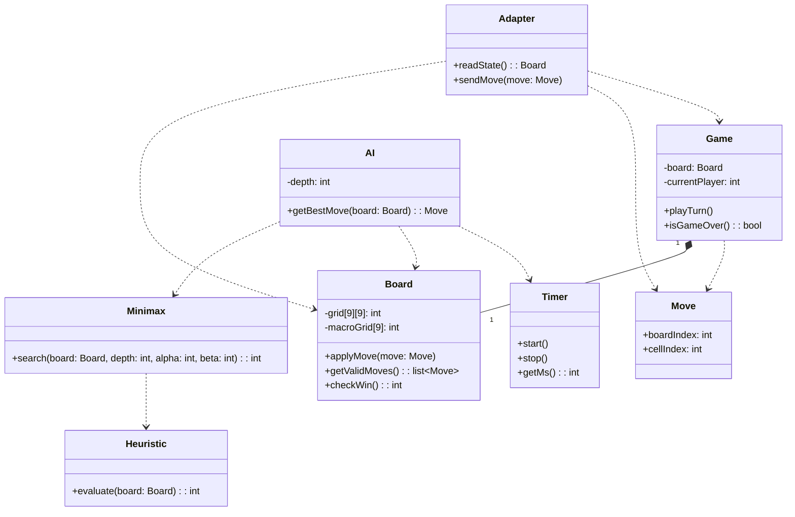

```mermaid
classDiagram

class Game {
    -board: Board
    -currentPlayer: int
    +playTurn()
    +isGameOver(): bool
}

class Board {
    -grid[9][9]: int
    -macroGrid[9]: int
    +applyMove(move: Move)
    +getValidMoves(): list~Move~
    +checkWin(): int
}

class Move {
    +boardIndex: int
    +cellIndex: int
}

class AI {
    -depth: int
    +getBestMove(board: Board): Move
}

class Minimax {
    +search(board: Board, depth: int, alpha: int, beta: int): int
}

class Heuristic {
    +evaluate(board: Board): int
}

class Adapter {
    +readState(): Board
    +sendMove(move: Move)
}

class Timer {
    +start()
    +stop()
    +getMs(): int
}

%% --- Core ---
Game "1" *-- "1" Board
Game ..> Move

%% --- AI ---
AI ..> Minimax
Minimax ..> Heuristic
AI ..> Board
AI ..> Timer

%% --- Interface ---
Adapter ..> Board
Adapter ..> Move
Adapter ..> Game
```