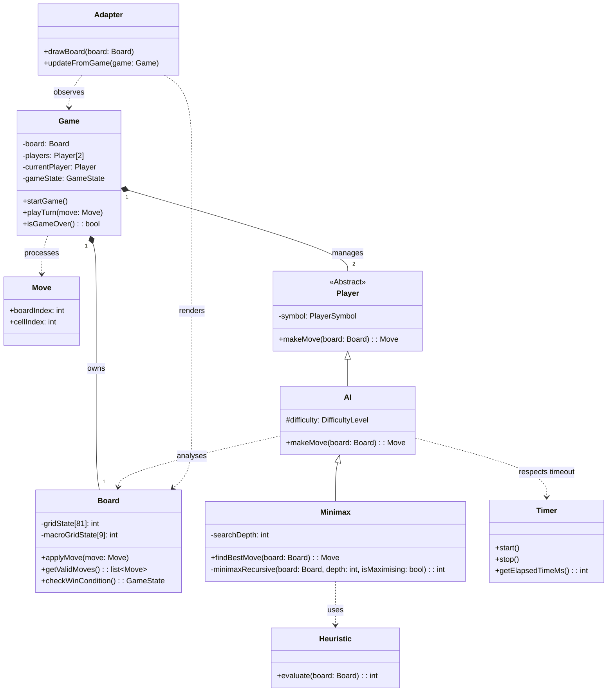

```mermaid
classDiagram
    class Game {
        -board: Board
        -players: Player[2]
        -currentPlayer: Player
        -gameState: GameState
        +startGame()
        +playTurn(move: Move)
        +isGameOver(): bool
    }
    class Board {
        -gridState[81]: int
        -macroGridState[9]: int
        +applyMove(move: Move)
        +getValidMoves(): list~Move~
        +checkWinCondition(): GameState
    }
    class Move {
        +boardIndex: int
        +cellIndex: int
    }
    class Player {
        <<Abstract>>
        -symbol: PlayerSymbol
        +makeMove(board: Board): Move
    }
    class AI {
        #difficulty: DifficultyLevel
        +makeMove(board: Board): Move
    }
    class Minimax {
        -searchDepth: int
        +findBestMove(board: Board): Move
        -minimaxRecursive(board: Board, depth: int, isMaximising: bool): int
    }
    class Heuristic {
        +evaluate(board: Board): int
    }
    class Timer {
        +start()
        +stop()
        +getElapsedTimeMs(): int
    }
    class Adapter {
        +drawBoard(board: Board)
        +updateFromGame(game: Game)
    }
    
    %% --- Core Game Logic ---
    Game "1" *-- "1" Board : owns
    Game "1" *-- "2" Player : manages
    Game ..> Move : processes
    
    %% --- Player Hierarchy & AI ---
    Player <|-- AI
    AI <|-- Minimax
    Minimax ..> Heuristic : uses
    AI ..> Board : analyses
    AI ..> Timer : respects timeout
    
    %% --- Interface ---
    Adapter ..> Game : observes
    Adapter ..> Board : renders
```
