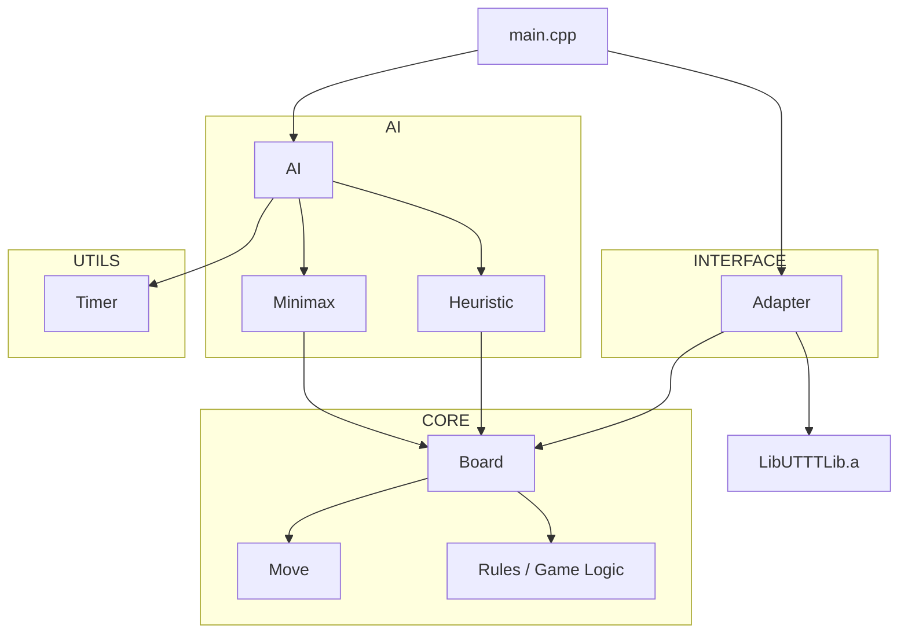

## Architecture

```mermaid
flowchart TD

A[main.cpp] --> B[Adapter]

B --> C[LibUTTTLib.a]

A --> D[AI]

D --> E[Minimax]
D --> F[Heuristic]

E --> G[Board]
F --> G

G --> H[Move]

B --> G

G --> I[Rules / Game Logic]

D --> J[Timer]

subgraph CORE
G
H
I
end

subgraph AI
D
E
F
end

subgraph INTERFACE
B
end

subgraph UTILS
J
end
```